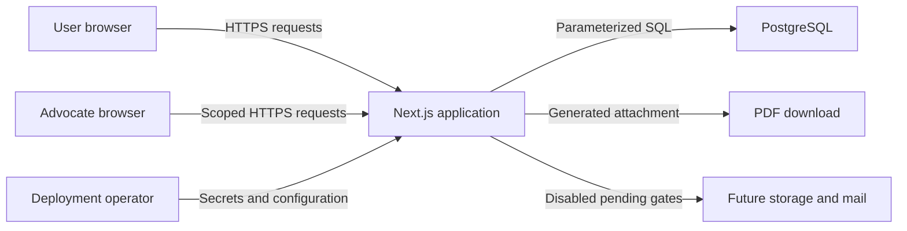

# Phase 3 repository threat model

## Executive summary

The highest risks are cross-case disclosure, over-broad advocate access, encryption-key compromise, and unsafe future activation of evidence, mail, safeguarding, or administrative integrations. The implemented Phase 3 core reduces current exposure through server-side ownership checks, granular time-bound grants, immediate consent revocation, authenticated exports, application-layer encryption, strict validation, no-store responses and closed-by-default integrations. Production remains blocked because independent penetration testing, operational governance, object storage, malware scanning, mail delivery and safeguarding ownership are not available.

## Scope and assumptions

- In scope: `src/app`, `src/components`, `src/domain`, `src/server`, `migrations`, runtime dependencies, and deployment/release scripts.
- Runtime is assumed to become internet-facing over HTTPS, serving multiple unrelated users from one Next.js/PostgreSQL deployment.
- Case data is highly sensitive special-category and criminal-offence data. Database and backup encryption, TLS termination and secret storage are deployment responsibilities not present in this repository.
- Object storage, external mail, real safeguarding referrals and production administration are not active. Tests use synthetic data only.
- Build scripts and isolated PostgreSQL tests are developer-controlled and are not production request surfaces.
- The master instruction says not to pause for ordinary confirmation, so no context check-in was requested. Risk rankings assume a public UK service with low-to-moderate initial scale.

Open questions: Who will operate incident response and safeguarding review? Which managed PostgreSQL, KMS, object-storage, malware-scanning and mail providers will be approved? What retention schedule and lawful bases will governance approve?

## System model

### Primary components

- Next.js 16 App Router renders public and authenticated pages and versioned route handlers (`src/app`, `src/proxy.ts`).
- Authentication uses passwordless links, HttpOnly SameSite cookies, rotating PostgreSQL sessions and rate limits (`src/server/auth.ts`, `src/server/auth-cookie.ts`).
- Casework uses parameterised PostgreSQL queries, AES-256-GCM envelopes, ownership/grant checks and audit events (`src/server/casework.ts`, `src/server/security/encryption.ts`).
- PostgreSQL stores resource catalogues, user profiles, consent, case metadata and encrypted narratives (`migrations/0001_phase1_foundation.sql` through `0003_phase3_casework.sql`).
- PDF generation runs inside the server process and returns attachment responses (`src/server/pdf-export.ts`). Evidence files and mail are intentionally absent.

### Data flows and trust boundaries

- Browser -> Next.js: HTTPS is assumed; HttpOnly session cookie, exact Origin checks for mutation, strict Zod schemas, bounded input and no-store output.
- Next.js -> PostgreSQL: pooled TLS depends on configuration; parameterised SQL; ownership or active grant checked before case access; sensitive narrative fields use AES-256-GCM.
- Next.js -> PDF download: authenticated request plus export permission; server-generated selectable text; attachment and `nosniff`; user-controlled text is normalised.
- Operator -> deployment: environment secrets and database credentials cross a high-trust boundary; release checks block missing configuration but no cloud secret manager is configured.
- Future Next.js -> object storage/mail: currently no runtime edge. Gates explicitly prevent activation until secure providers and operational controls exist.

#### Diagram

## Assets and security objectives

| Asset | Why it matters | Security objective (C/I/A) |
|---|---|---|
| Case facts, identity and narratives | Disclosure can create physical, discrimination and legal harm | C high, I high, A medium |
| Evidence and generated documents | May contain original legal material and third-party data | C high, I high, A medium |
| Sessions and invitation tokens | Permit account or delegated-case access | C high, I high, A high |
| Consent and access grants | Define whether disclosure is authorised | I high, C high, A high |
| Audit and safeguarding records | Needed for accountability and incident investigation | I high, A high, C high |
| Encryption keys and database credentials | Compromise can expose all tenants | C critical, I critical, A medium |
| Dataset provenance | Wrong routes can harm users in crisis | I high, A high, C low |

## Attacker model

### Capabilities

- Anonymous remote clients can send crafted requests to public endpoints and authentication flows.
- Authenticated users and advocates can alter identifiers, replay requests and attempt access beyond ownership or grant scope.
- A malicious invite recipient can disclose tokens or exploit stale grants.
- An administrator or deployment operator may misuse database, key or future break-glass access.

### Non-capabilities

- Remote attackers are not assumed to control the server, PostgreSQL host, CI workstation or deployment environment initially.
- No evidence upload parser, object-storage delivery, external email sender or real safeguarding connector exists in the current runtime.
- Independent compromise of the user's device, mailbox or a future provider is not directly preventable by this repository.

## Entry points and attack surfaces

| Surface | How reached | Trust boundary | Notes | Evidence |
|---|---|---|---|---|
| Authentication APIs | Public HTTPS | Browser -> app | Generic response, hashed tokens, expiry, rate limit | `src/server/auth.ts`; `src/app/api/v1/auth` |
| Case APIs | Authenticated HTTPS | Browser -> app -> DB | Zod strict schemas, Origin checks, owner/grant checks | `src/server/case-api.ts`; `src/app/api/v1/cases` |
| Advocate invitation | Authenticated HTTPS/token | Two users -> app | Email-bound, hashed, expiring token; mail disabled | `src/server/casework.ts` `createInvitation`, `acceptInvitation` |
| Consent revocation | Authenticated DELETE | Owner -> app -> DB | Transactionally revokes linked invitation and grant | `src/server/casework.ts` `revokeConsent` |
| Case export/PDF | Authenticated GET | App -> browser | Separate export permission, attachment, no-store | `src/app/api/v1/cases/[caseId]/export/route.ts` |
| Admin pages | Authenticated server render | User -> privileged role | Active verified role required; queues are placeholders | `src/components/secure-workspace.tsx` |
| Dataset imports | Developer/operator CLI | Files -> tooling -> DB | Controlled revision and reconciliation | `src/domain/import`; `scripts/import-datasets.ts` |

## Top abuse paths

1. Attacker signs in -> changes a case UUID -> server omits ownership check -> reads another person's narrative. Existing central access checks and synthetic denial tests reduce this, but every future query must use the same boundary.
2. Advocate receives a narrow grant -> accesses timeline/export endpoint -> endpoint checks only authentication -> exfiltrates unconsented data. Current timeline and export permissions are separate.
3. User revokes consent -> cached or stale grant remains usable -> advocate continues access. Current checks query active grant state on every request; shared caches must remain disabled.
4. Operator leaks the encryption master key and database backup -> decrypts all application-encrypted fields. KMS, key rotation and encrypted backup operations remain deployment blockers.
5. Future evidence upload accepts spoofed MIME or malicious PDF -> scanner is bypassed -> staff device compromise or direct object leakage. The current application accepts metadata only.
6. Future email integration sends a draft without review -> sensitive fields reach the wrong recipient. The current application provides copy-only preparation and has no provider adapter.
7. Privileged user invokes break glass without sufficient reason -> browses sensitive case content -> audit is incomplete or not reviewed. Schema exists, but operational approval and alerting do not.
8. Crafted long case content triggers resource exhaustion during export -> availability loss. Input is bounded and export selection is capped, but process-level quotas need load testing.

## Threat model table

| Threat ID | Threat source | Prerequisites | Threat action | Impact | Impacted assets | Existing controls (evidence) | Gaps | Recommended mitigations | Detection ideas | Likelihood | Impact severity | Priority |
|---|---|---|---|---|---|---|---|---|---|---|---|---|
| TM-001 | Authenticated user | Valid account and guessed UUID | Cross-case IDOR | Sensitive disclosure | Case data | `checkCaseAccess`; parameterised queries; synthetic denial proof | Independent review absent | Require access helper in every new repository method; add route-level negative integration tests | Alert on repeated 404s across case IDs | medium | high | high |
| TM-002 | Advocate | Active but narrow grant | Uses over-broad route or export | Unconsented disclosure | Case, evidence, identity | Per-permission grants; export permission; immediate revocation | Field-level projection is incomplete for all future domains | Introduce typed policy object and SQL projection per resource/sensitivity | Audit denied permission and unusual export attempts | medium | high | high |
| TM-003 | Operator or secret thief | DB plus master key access | Bulk decrypts records/backups | System-wide disclosure | All sensitive data | AES-256-GCM with AAD (`encryption.ts`) | No KMS, rotation ceremony or deployed backup encryption | Managed KMS/envelope keys per environment; rotation and restore drills | KMS access alerts; database export detection | low-medium | high | high |
| TM-004 | Malicious uploader | Evidence feature enabled prematurely | Uploads malware/polyglot or obtains object URL | Device compromise/data leak | Evidence, users | Storage state constrained; no bytes accepted; `EVIDENCE-001` open | Provider/scanner/redaction absent | Keep feature flag off; content sniffing, AV/CDR, quarantine, opaque keys, authorised streaming | Scan failures, hash anomalies, download spikes | low now, high if enabled | high | high conditional |
| TM-005 | Mistaken or malicious sender | Mail adapter enabled | Sends without review or wrong consent | External disclosure | Communications, case data | No adapter; draft-only status constraints; `MAIL-001` open | OAuth/provider and delivery controls absent | Explicit approval nonce, recipient re-entry for sensitive mail, sandbox tests | Delivery failure and recipient-domain anomaly alerts | low now | high | medium conditional |
| TM-006 | Privileged insider | Admin/safeguarding role or DB access | Misuses break glass | Targeted disclosure/tampering | Case, audit | Role checks; break-glass schema | No operational approval, immutable audit or review service | Dual approval, short TTL, append-only/WORM audit, mandatory review | Immediate alert to privacy owner and affected user where lawful | medium | high | high |
| TM-007 | Remote attacker | Public endpoints | Brute force or request flood | Availability/auth abuse | Sessions, service | Login and selected mutation rate limits; generic errors | Distributed limiting and monitoring absent | Edge rate limit by IP/account/device; backoff and capacity tests | 429 rate, auth failure and latency dashboards | medium | medium | medium |
| TM-008 | Crafted content author | Valid case access | Creates PDF/control-character payload or oversized export | Corrupt output/resource exhaustion | Exports, availability | Bounded schemas; text normalisation; selection caps; attachment | No PDF tagging support; limited load/fuzz testing | Fuzz Unicode and layout; worker limits; safer font embedding; accessibility validator | Export failures, duration and memory metrics | low-medium | medium | medium |
| TM-009 | XSS attacker | Finds rendering sink/dependency flaw | Steals non-HttpOnly data or acts as user | Case integrity/disclosure | User session, case | React escaping; CSP; HttpOnly cookie; no narrative local storage | CSP needs browser regression; style unsafe-inline remains | Nonce styles if framework permits; browser CSP tests; Trusted Types evaluation | CSP violation reporting | low-medium | high | medium |
| TM-010 | Retention worker/operator | Policy misconfiguration | Deletes protected records or retains too much | Legal/user harm | Case, audit, safeguarding | Retention/deletion schema; account deletion notice | Approved schedule and production job absent | Governance-approved policy, dry-run reports, legal holds, deletion verification | Due-job drift and exception-volume alerts | medium | high | high |

## Criticality calibration

- Critical: unauthenticated system-wide case export, production evidence objects publicly reachable, or remote code execution in a file parser.
- High: cross-user case access, stale advocate access after revocation, key-plus-backup compromise, or unauthorised break-glass browsing.
- Medium: targeted export denial of service, CSP regression requiring a separate XSS, or brute force constrained by rate limits.
- Low: metadata disclosure with no user-sensitive content, noisy rejected requests, or issues confined to synthetic test tooling.

## Focus paths for security review

| Path | Why it matters | Related Threat IDs |
|---|---|---|
| `src/server/casework.ts` | Central ownership, permission, encryption and audit boundary | TM-001, TM-002, TM-006 |
| `src/server/case-api.ts` | Authentication, Origin validation, parsing and rate limiting | TM-001, TM-007 |
| `src/server/auth.ts` | Passwordless token and session lifecycle | TM-007, TM-009 |
| `src/server/security/encryption.ts` | Key handling and authenticated encryption | TM-003 |
| `src/app/api/v1/cases` | Resource-specific policy enforcement | TM-001, TM-002, TM-008 |
| `src/app/api/v1/advocate` | Invitation token and identity binding | TM-002 |
| `src/server/pdf-export.ts` | User-controlled text enters a binary export generator | TM-008 |
| `src/proxy.ts` | CSP and browser security boundary | TM-009 |
| `migrations/0003_phase3_casework.sql` | Consent, grant, evidence and break-glass invariants | TM-002, TM-004, TM-006, TM-010 |
| `scripts/lib/logical-backup.mjs` | Sensitive backup completeness and restore behaviour | TM-003, TM-010 |

## Notes on use

- Entry points and all identified trust boundaries are represented above.
- Runtime, deployment/operator and developer-only tooling are separated.
- Rankings are conditional on a future public HTTPS deployment and currently disabled external integrations.
- Reassess before closing `EVIDENCE-001`, `MAIL-001`, `SAFEGUARD-001`, `RETENTION-001` or `PENTEST-001`.
